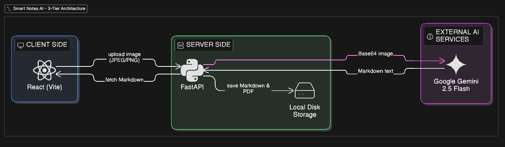
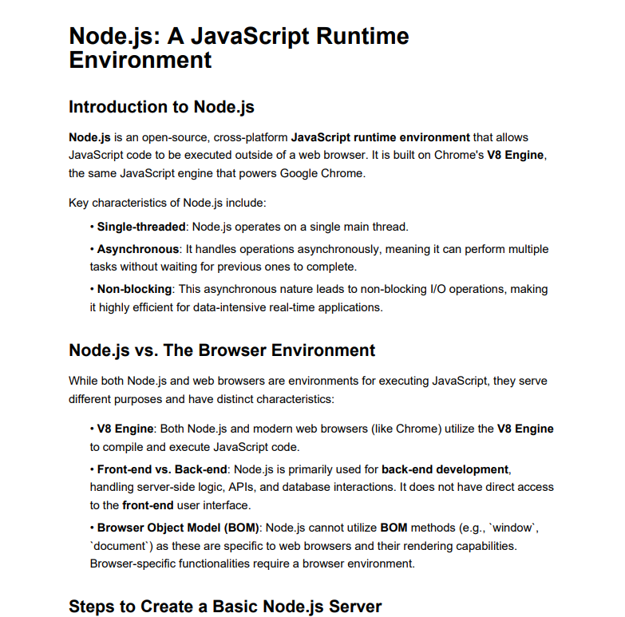

# 📝 Smart Notes AI: Handwriting-to-Textbook Transformer

**Smart Notes AI** is a full-stack application that transforms messy, handwritten lecture notes into structured, professional textbook-style documents. Using **Multimodal AI (Gemini 2.5 Flash)** and a **FastAPI/React** architecture, it doesn't just perform OCR; it interprets concepts, fixes technical terminology, and formats output into clean Markdown.

---

## 🚀 Key Features

* **Multimodal Vision:** Leverages Google's Gemini API to "read" and understand handwriting context.
* **Academic Enhancement:** Automatically corrects shorthand (e.g., "Nodes sv" becomes "Node.js Server").
* **Modern UI:** Features a glassmorphism design with a "Magic Wand" loading state for enhanced UX.
* **Live Preview:** Real-time Markdown rendering for instant review.
* **Textbook Formatting:** Outputs structured headers, bold key terms, and bulleted lists.

---

## 🛠️ Tech Stack

### **Frontend**
* **React + Vite:** For a blazing-fast, reactive user interface.
* **React-Markdown:** To render AI output into formatted textbook pages.
* **Lucide-React:** For modern, minimalist iconography.

### **Backend**
* **FastAPI (Python):** High-performance asynchronous API framework.
* **Google Generative AI:** Gemini 2.5 Flash for vision and text generation.
* **Uvicorn:** ASGI server for production-grade hosting.

---

## 📂 Project Structure

* **backend/**
    * `main.py` — FastAPI routes & AI Logic
    * `uploads/` — Temporary storage for note images
    * `requirements.txt` — Python dependencies
* **frontend/**
    * `src/App.jsx` — Main UI & API integration
    * `src/App.css` — Modern Glassmorphism styling
    * `package.json` — Node.js dependencies

---

## ⚙️ Installation & Setup

### **1. Clone the Repository**
* `git clone https://github.com/JeevithaPugazh/smart_notes.git`
* `cd smart_notes`

### **2. Backend Setup**
* Navigate to the backend: `cd backend`
* Create a `.env` file and add your API Key:
    * `GEMINI_API_KEY=your_google_api_key_here`
    * `PORT=8000`
* Install dependencies: `pip install -r requirements.txt`
* Run the server: `python -m uvicorn main:app --reload`

### **3. Frontend Setup**
* Navigate to the frontend: `cd ../frontend`
* Install dependencies: `npm install`
* Run the app: `npm run dev`

---

## 🤖 How the AI Model Works

The project uses a **Zero-Shot Multimodal Inference** approach:

1. **Image Encoding:** The handwritten image is converted to a base64 string for API transmission.
2. **Prompt Engineering:** A "System Instruction" tells the AI to act as a *Technical Editor*.
3. **Contextual Correction:** Instead of simple character recognition, the model identifies technical patterns (e.g., recognizing "V8" in a coding context) to fix spelling errors.
4. **Markdown Synthesis:** The model returns structured Markdown, which the frontend renders into a readable textbook format.

---

## 📸 App Preview

### 🏗️ How it Works

## 🖼️ Gallery

| Upload Handwriting | AI Transformation |
| :--- | :--- |
|  |  |